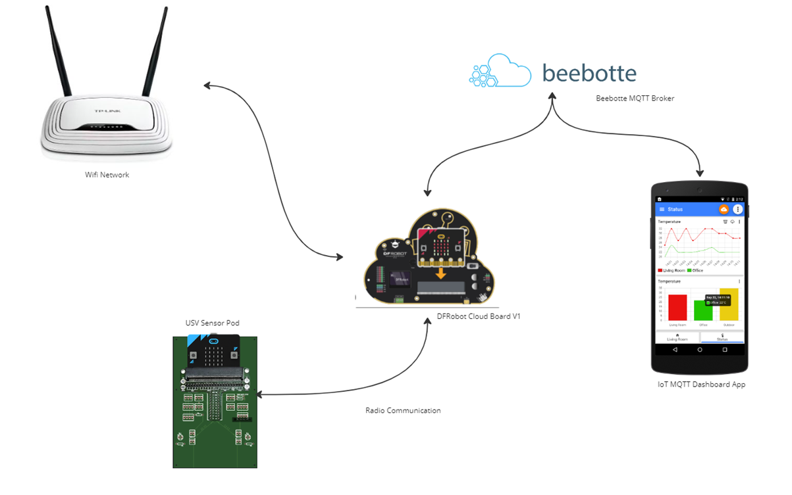

# MQTT Design Pattern
This section will guide you through the design pattern used to recieve live data from the sensor pod using the Microbit Cloud Board to send data to Beebotte via MQTT.

        

# USV User

The USV User script is the only script that can be changed by the User. 

It uses the USV's Microbit library to code Missions using the USV and the Sensor Pod

# USV-Lir

The USV is loaded with the USV-OnBoard.ts script as well as the Sensor-Deploy-Mech.ts script

These scripts control the USV's basic functionality such as its motor control and sensor deployment, as well as its autonamous drive features.

# Sensor Pod
The sensor pod itself is loaded with Sensor-Pod-Comms.ts.

This script gives the Sensor pod two states it can be in:
- State 0 (Not Sumberged)
- State 1 (Submerged)

Currently the Sensor Pod listens over the radio network for a sensor deploy command from the USV User microbit, this is how the sensor pod knows if it has been sumberged or if it is still above water

- When the Sensor pod is Submerged it takes readings of all its sensors and stores the information to an ArrayList for later use.

 - When the Sensor Pod is Not Sumberged it loops through each ArrayList and sends the value over the radio network and then deletes that value in the ArrayList to avoid duplicates.

# Cloud Board

The Cloud Boards main function is to listen to the Radio network for any sensor data and when it recieves data from the sensor pod it posts that data to the Beebotte MQTT Broker which can then be viewed on either Beebotte.com or through an MQTT App.

