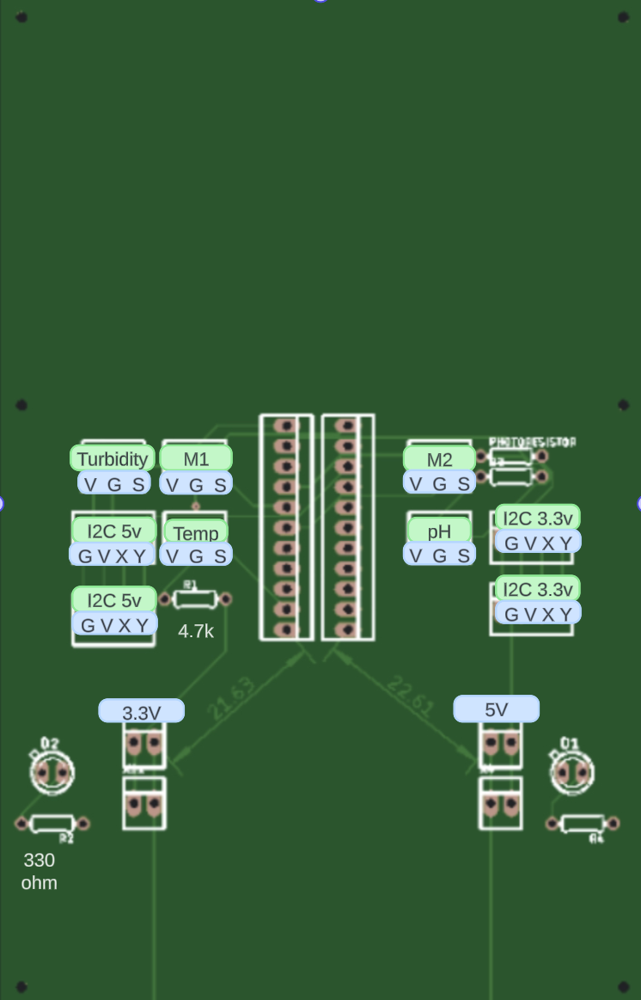

# Sensor Pod Hardware
This section will guide you through the hardware components of the project.

## Component Requirements

- Sensor Pod PCB 
- [Microbit Breadboard adapter](https://shop.sb-components.co.uk/products/bbc-micro-bit-breadboard-adapter)
- [I2C LCD Screen adapter](https://makershop.ie/I2C-Display-Backpack)
- [LCD Screen](https://makershop.ie/2004-lcd-display)
- [DS18B20 Arduino Temperature sensor](https://docs.rs-online.com/8ff0/A700000007238410.pdf)

- [DFRobot pH sensor](https://wiki.dfrobot.com/PH_meter_SKU__SEN0161_)
- [DFRobot Turbidity sensor](https://www.dfrobot.com/product-1394.html)
- LDR
- [Breadboard 3.3/5v power adapter](https://www.temu.com/ul/kuiper/un9.html?subj=goods-un&_bg_fs=1&_p_jump_id=894&_x_vst_scene=adg&goods_id=601099524060004&sku_id=17592249334945&adg_ctx=a-482cf3d7~c-43d59b61~f-463dbfff&_x_ads_sub_channel=shopping&_p_rfs=1&_x_ns_prz_type=3&_x_ns_sku_id=17592249334945&mrk_rec=1&_x_ads_channel=google&_x_gmc_account=5065455600&_x_login_type=Google&_x_ads_account=2203484323&_x_ads_set=20919102191&_x_ads_id=155316983217&_x_ads_creative_id=686783349077&_x_ns_source=g&_x_ns_gclid=CjwKCAiA6KWvBhAREiwAFPZM7lw7KHpV1pLe10BDq9XhTBV1jnwFbHwcnbU3hkniE9NLrchK2P2d6RoCdX8QAvD_BwE&_x_ns_placement=&_x_ns_match_type=&_x_ns_ad_position=&_x_ns_product_id=17592249334945&_x_ns_target=&_x_ns_devicemodel=&_x_ns_wbraid=Cj4KCAiAxaCvBhAgEi4AgR6XDq6UXE4fYZQUN6XEo4gJccqdmZYewUQlk73z8OPdRryBSgXBhjQRLs01GgJ6gg&_x_ns_gbraid=0AAAAAo4mICGMshVsdonRG9UQYtJAb891n&_x_ns_targetid=pla-995371219663&gad_source=1&gclid=CjwKCAiA6KWvBhAREiwAFPZM7lw7KHpV1pLe10BDq9XhTBV1jnwFbHwcnbU3hkniE9NLrchK2P2d6RoCdX8QAvD_BwE)
- 4.7k Resistor (for temperature sensor)
- 10k Resistor (for LDR)
- 330 ohm Resistor x2 (Power LEDS)
- Pin sockets
- Enclosure

# Pin outs

On the sensor pod each sensor has its own dedicated pin slot, 
This means that components will only go one way into the device.

The I2C connections can be swapped aslong as the right voltage is being supplied to the I2C device. e.g. The LCD display must have 5v power to work correctly.

Below you will find the current PCB iteration along with letters over specific pins to indicate what those pins do.

- V = VCC (Power 3.3v or 5v)
- G = Ground
- S = Signal
- X = SDA (I2C)
- Y = SCL (I2C)

        

